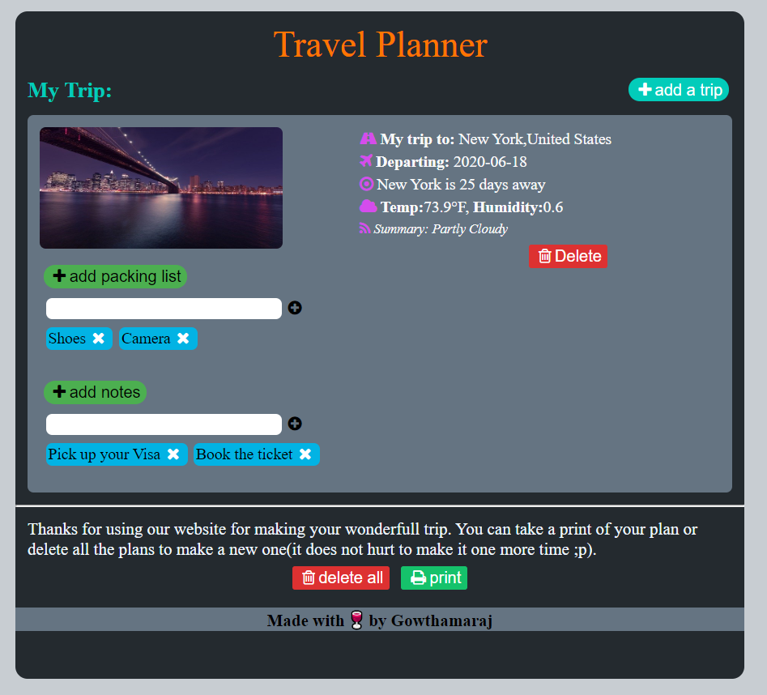
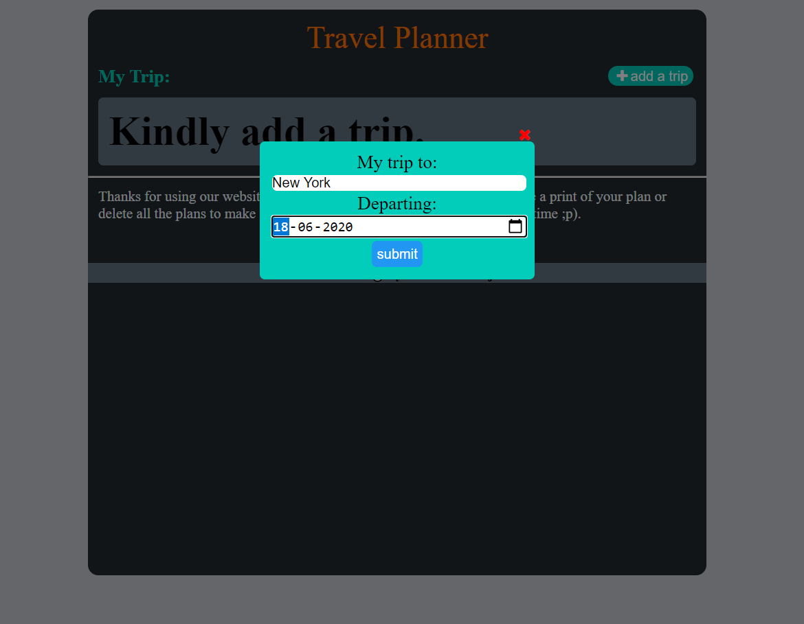
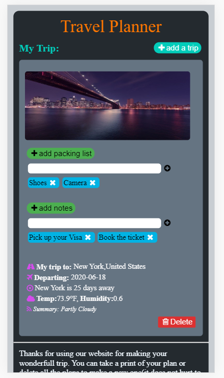

# Travel Planner App
This project is about building out a travel app that obtains a desired trip location &amp; date from the user, and displays weather and an image of the location using information obtained from external APIs.

The project is a building web tool that allows users to run different APIs to get the data and plan for the trip. This tool will give us back pertinent information about the place, like temperatue and humidity.

Node and express used for webserver and routing, and webpack will be our build tool of choice. Using webpack, we will set up the app to have development and production environments, each with their own set of tools and commands.

I have also added Jest to test the routes and other JavaScript functions of the application.

## Run project
Below shows how to run in development and production mode.

### Run in development mode
To start the webpack dev server @ port 8080 and node server @3000
```sh
` $ npm run build-dev`
` $ npm run start`
```


### Run in production mode
Generate the dist files and then start server at port 3000
```sh
` $ npm run build-prod`
```
To start the node server, use the command given below.
```sh
` $ npm run start`
```


### .env file
We need API key for the services we are going to use. (Geonames,Pixabay,weatherbit)
#### Steps:
1. Create account and get the key from the API providers.(Geonames,Pixabay,weatherbit)
2. Create a file named '.env' to store the API keys.
3. import the file using a module called 'dotenv' in the node server file.
4. Inside the .env file, save `API_GEO={API key}`, `API_PIX={API key}` and `API_BIT={API key}` in individual lines.


## Configs
I have made 2 webpack config files for both development mode(`webpack.config.dev.js`) and production mode(`webpack.config.prod.js` )

## Offline Functionality
The project has service workers set up in webpack to provide the offline functionality of our app. 

## Testing
Testing is done with Jest. To run test, use the command 
`npm run test`. 


## Interactions
### Home page



It is a single page web app. It has a single form input field that accepts user input(city), then runs a check to make sure it is valid. If it is not valid, it will return back. If not, it will fetch the data using the API and display it to us.

##### In Mobiles

